<h2 align="center">Valkyrie — SVG/XML to Compose ImageVector converter</h2>

<div align="center">
    
</div>

<div align="center">

[![Marketplace version][badge:marketplace-version]][url:plugin-homepage]
[![Github plugin release][badge:idea-release]][url:gh-releases]
[![Downloads][badge:marketplace-downloads]][url:plugin-homepage]
[![Rating][badge:marketplace-rating]][url:plugin-homepage]

[![CLI release][badge:cli-release]][url:gh-releases]
[![Homebrew][badge:homebrew]][url:homebrew]

[![Gradle Plugin Portal][badge:gradle-plugin]][url:gradle-plugin]

[![Telegram][badge:telegram-invite]][url:telegram-invite]
[![Slack][badge:slack-invite]][url:slack-invite]
![Test coverage][badge:coverage]
[![License][badge:license]][url:gh-license]

</div>

## Motivation

During the development Jetpack Compose / Compose Multiplatform, we often faced the challenge of
converting icons from SVG or XML format to ImageVector. While there are existing tools available for this purpose, we
found that they often fell short in terms of usability, reliability, and the quality of the generated code and in some
cases, even being paid 😄.

To address these issues, we decided to create our own tool that would streamline the conversion process and provide a
better user experience.

The primary goal of this project is to offer a fast, reliable, and user-friendly solution for converting SVG and XML
icons to ImageVector format, while also allowing for customization of the generated code to meet individual project
needs.

> [!NOTE]
> This project is especially relevant now as Material Icons is no longer maintained and not recommended for use in your
> apps.
> [Learn more](https://developer.android.com/develop/ui/compose/graphics/images/material).

## Available tools:

- 🔌 [IntelliJ IDEA / Android Studio plugin](#idea-plugin)
- 🖥️ [CLI tool](#cli-tool)
- 🐘 [Gradle plugin](#gradle-plugin)
- Web app (🚧 under development 🚧)

## Table of Contents

- [Key features](#key-features)
- 🔌 [IDEA plugin](#idea-plugin)
  - [Plugin features](#plugin-features)
  - [Simple mode](#simple-mode)
  - [IconPack mode](#iconpack-mode)
    - [Create new icon pack](#new-icon-pack)
    - [Update existing icon pack](#existing-icon-pack)
  - [ImageVector previewer](#imagevector-previewer)
    - [Embedded previewer](#embedded-previewer)
    - [AutoCompletion previewer](#autocompletion-previewer)
    - [Gutter previewer](#gutter-previewer)
  - [Requirements](#requirements)
  - [Installation](#installation)
  - [Build plugin](#build-plugin)
- 🖥️ [CLI tool](#cli-tool)
  - [Install](#install-cli)
  - [Available commands](#available-commands)
    - [`iconpack` command](#iconpack-command)
    - [`svgxml2imagevector` command](#svgxml2imagevector-command)
    - [`changelog` command](#changelog-command)
  - [Build](#build-cli)
- 🐘 [Gradle plugin](#gradle-plugin)
  - [Plugin configuration](#plugin-configuration)
  - [Samples](#gradle-plugin-samples)
    - [Basic conversion](#basic-conversion)
    - [Icon pack configuration](#icon-pack-configuration)
    - [Icon pack with nested packs configuration](#icon-pack-with-nested-packs-configuration)
  - [Tips and tricks](#tips-and-tricks)
- [Other](#other)
  - [Export formats](#export-formats)
  - [Comparison with other solutions](#comparison-with-other-solutions)
  - [Migration guide](#migration-guide)

## Key features

### Core functionality:

- Support conversion from SVG and XML
- Custom [kotlinpoet](https://github.com/square/kotlinpoet) generator with streamlined code formatting:
  * code alignment and formatting
  * remove redundant code by default (e.g. `public` keyword)
  * remove unused imports (e.g. `kotlin.*` package)
  * skip default ImageVector parameters
  * support generation as [backing property or lazy property](#export-formats)
  * optional trailing comma and explicit mode
  * customize code indent
- Ability to create your unique project icon pack (+nested packs if necessary)
- High performance (6k icons processing ~5sec)

## 🔌IDEA Plugin

### Plugin features

- Two conversion modes: [Simple](#simple-mode) and [IconPack](#iconpack-mode)
- Support for Drag&Drop files/directories and pasting content from clipboard
- Easy option to add more icons into existing project icon pack
- Export generated ImageVector to clipboard or file (depends on the mode)
- Fully customizable setting for generated icons
- Build-in [ImageVector previewer](#imagevector-previewer) for any icons without compilation ✨
- The plugin is completely built using [Compose Multiplatform](https://github.com/JetBrains/compose-multiplatform)
  and [Tiamat](https://github.com/ComposeGears/Tiamat) navigation library

More exclusive features under development, stay tuned 🌚

### **Simple mode**

> [!NOTE]
> One-click solution to convert SVG/XML to ImageVector (requires only specifying the package).

#### Available quick actions:

- Rename icon
- Preview current ImageVector
- Copy generated ImageVector to clipboard

<div align="center">
    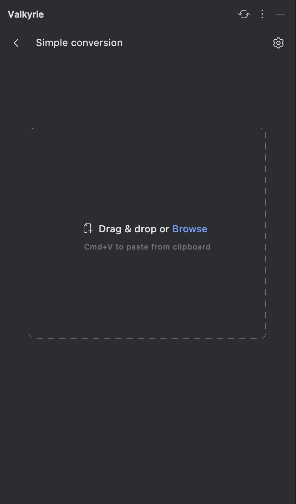
    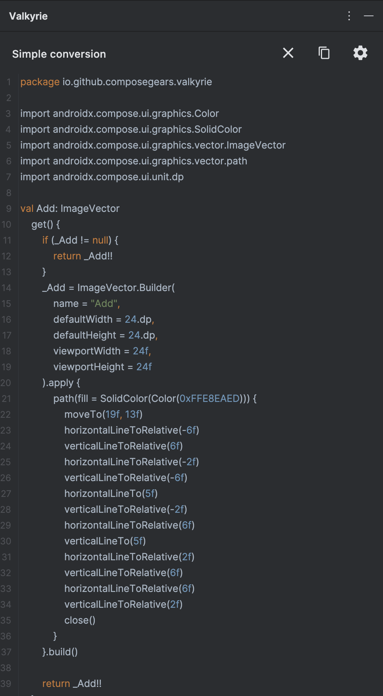
    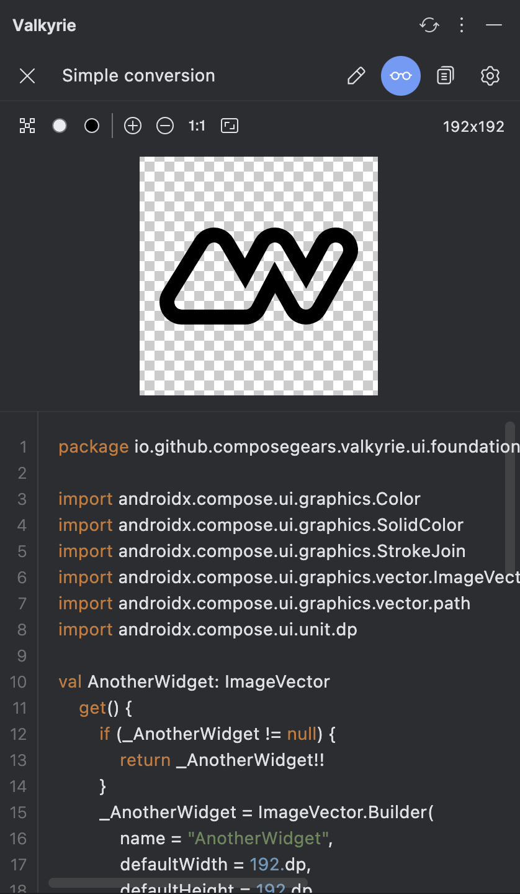
</div>


Demo:

https://github.com/user-attachments/assets/f48eb027-ccb2-4194-87bb-868c6be222ae

### **IconPack mode**

#### **New icon pack**

> [!NOTE]
> Facilitates creating an organized icon pack with extension properties for your pack `object`, previewing the list of
> icons, and batch exporting them to your specified directory.

<div align="center">
    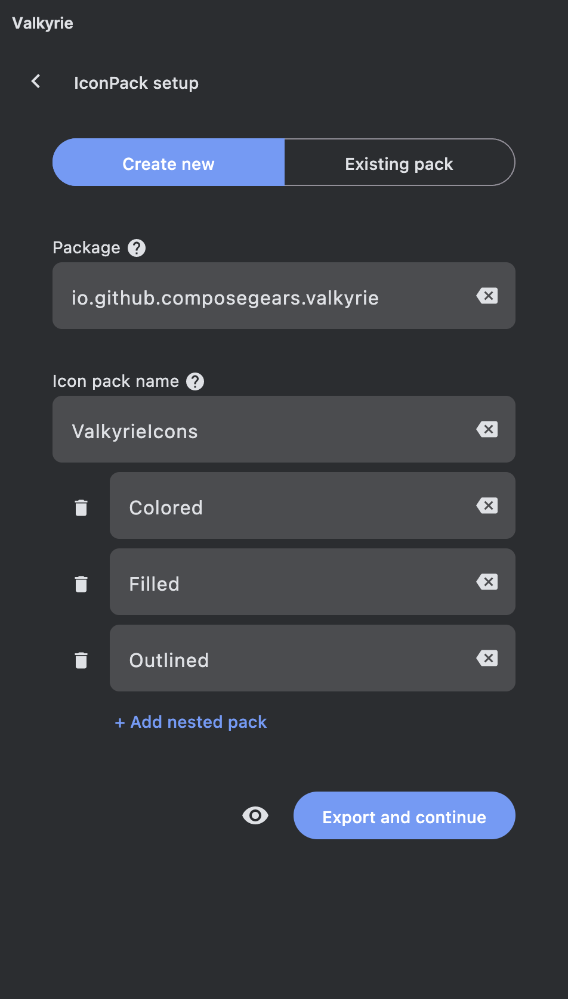
    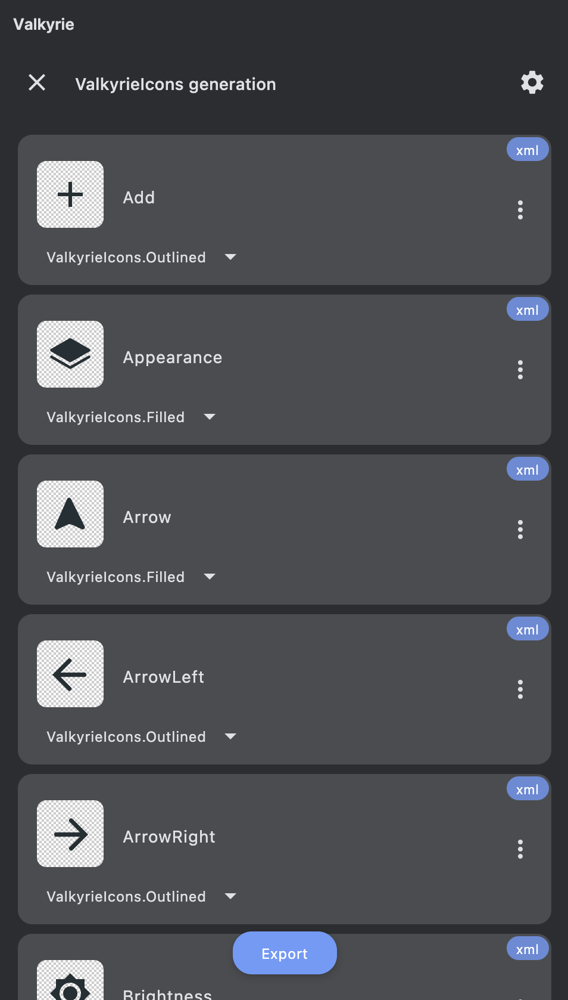
</div>

Demo:

https://github.com/user-attachments/assets/ccb568a4-bda9-4f2b-bf40-29b1a8e4c854

#### **Existing icon pack**

> [!NOTE]
> Instead of importing icon pack settings, the plugin provides a direct way to import an already created icon pack from
> a Kotlin file.

<div align="center">
    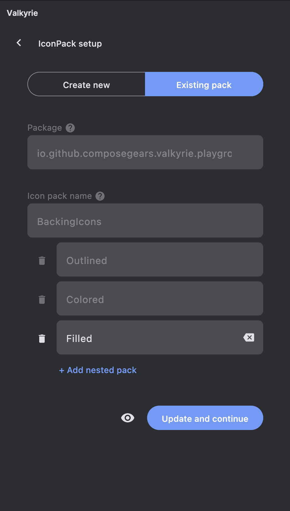
    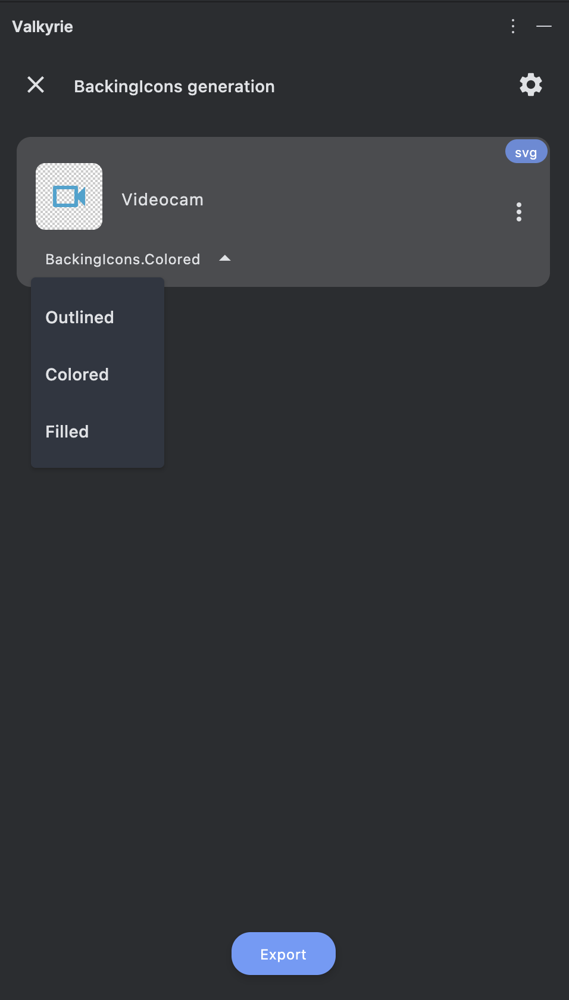
</div>

> [!IMPORTANT]
> Editing features are limited for now; you can only load an existing pack and add more nested packs.

Demo:

https://github.com/user-attachments/assets/77f449dd-a6d0-44ea-9059-b7b30ee94426

### ImageVector Previewer

#### Embedded Previewer

We personally find it very useful to have a previewer for ImageVector (such we have for SVG or XML).
Previewer available for any ImageVector formats (backing or lazy property, legacy google material icons) without
compose @Preview annotation and project compilation.

<div align="center">
    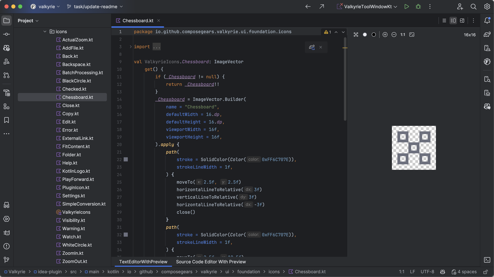
</div>

Previewer actions:

- Change icon background (pixel grid, white, black)
- Zoom in, zoom out icon without loosing quality
- Draw as actual size
- Fit icon to window

Demo:

https://github.com/user-attachments/assets/1047a2b3-81ec-4e10-a118-0ff20bd5227b

#### AutoCompletion Previewer

When IDEA auto-completion popup is shown for any ImageVector property, the preview image will be displayed in the popup.

<div align="center">
    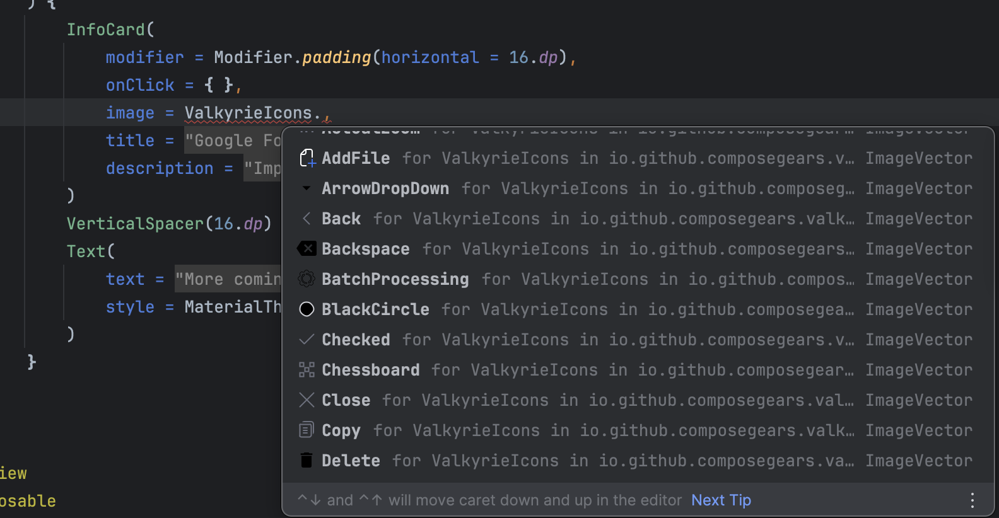
</div>

#### Gutter Previewer

Preview inside gutter available for any ImageVector property. By clicking on the gutter icon, the original file will be
opened in the editor with embedded previewer.

<div align="center">
    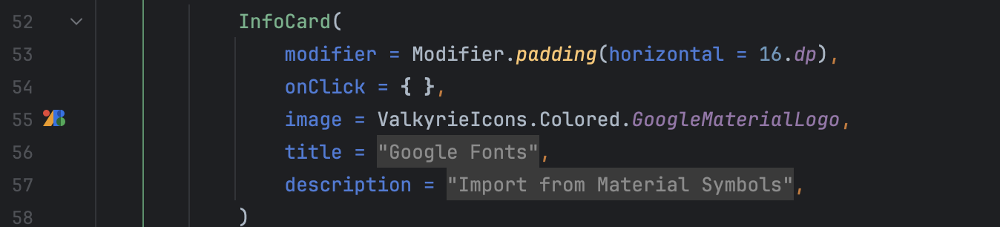
</div>

### Requirements

| Plugin version | Min IntelliJ IDEA / Android Studio           |
|----------------|----------------------------------------------|
| 0.1.0 - 0.14.0 | IntelliJ IDEA 2024.1, Android Studio Koala   |
| 0.15.0+        | IntelliJ IDEA 2024.2, Android Studio Ladybug |

### Installation

<a href="https://plugins.jetbrains.com/plugin/24786-valkyrie" target="_blank">
    
</a>

- **Find plugin inside IDE**:

  <kbd>Settings</kbd> > <kbd>Plugins</kbd> > <kbd>Marketplace</kbd> > <kbd>Search for <b>"Valkyrie"</b></kbd> >
  <kbd>Install Plugin</kbd>

- **Manually**:
  Download the [latest release](https://github.com/ComposeGears/Valkyrie/releases/latest)
  or [build your self](#build-plugin) and install it manually using
  <kbd>Settings</kbd> -> <kbd>Plugins</kbd> -> <kbd>⚙️</kbd> -> <kbd>Install plugin from disk...</kbd>

### Build plugin

Precondition: IntelliJ IDEA with installed [Plugin DevKit](https://plugins.jetbrains.com/plugin/22851-plugin-devkit)

Run `./gradlew buildPlugin` to build plugin locally. Artifact will be available in
`tools/idea-plugin/build/distributions/`
folder

or run plugin in IDE using: `./gradlew runIde`

## 🖥CLI tool

CLI tools can be easily integrated into scripts and automated workflows, allowing you to convert icons from specific
source with predefined settings.

### Install CLI

- #### via brew

```bash
brew install ComposeGears/repo/valkyrie
```

- #### manually via binary release

Download latest CLI tool from [releases](https://github.com/ComposeGears/Valkyrie/releases).

Unzip the downloaded archive and run the CLI tool from `bin` folder in the terminal

```bash
./valkyrie
```

You should see this message
<div align="center">

</div>

- #### automatically using bash script

A simple example of how to get the latest version of the CLI tool. It can be executed on CI/CD with predefined
parameters.

```bash
#!/bin/bash

VERSION="cli-1.0.0"
TARGET_DIR="valkyrie-cli"
ASSET_NAME="tmp.zip"

LATEST_CLI_RELEASE_URL=$(curl --silent "https://api.github.com/repos/ComposeGears/Valkyrie/releases/tags/$VERSION" \
  | jq -r '.assets[] | select(.name | startswith("valkyrie-cli")) | .browser_download_url')

curl -L -o "$ASSET_NAME" "$LATEST_CLI_RELEASE_URL"
mkdir -p "$TARGET_DIR"
unzip -o "$ASSET_NAME" -d "$TARGET_DIR"

rm "$ASSET_NAME"

cd "$TARGET_DIR/bin" || exit
./valkyrie --version
```

### Available commands:

#### `iconpack` command

A part of the CLI tool that allows you to create an icon pack with nested packs.

Usage:

```text
./valkyrie iconpack [<options>]
```

<div align="center">
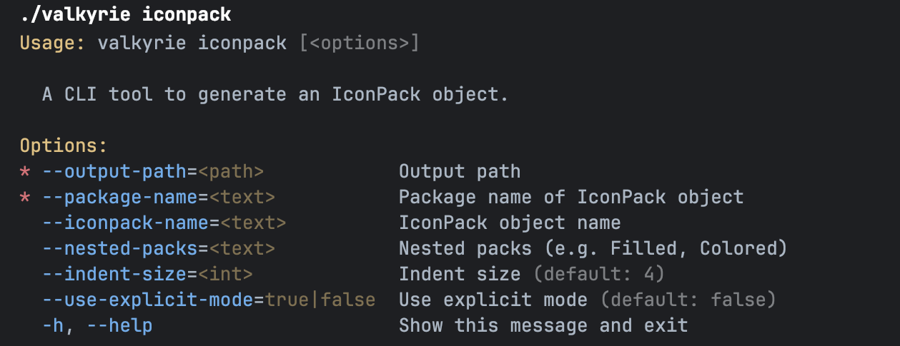
</div>

Demo:

https://github.com/user-attachments/assets/dc56f3e6-6831-4230-a8cc-a0c486d4c288

#### `svgxml2imagevector` command

A part of the CLI tool that allows you to convert SVG/XML files to ImageVector.

Usage:

```text
./valkyrie svgxml2imagevector [<options>]
```

<div align="center">
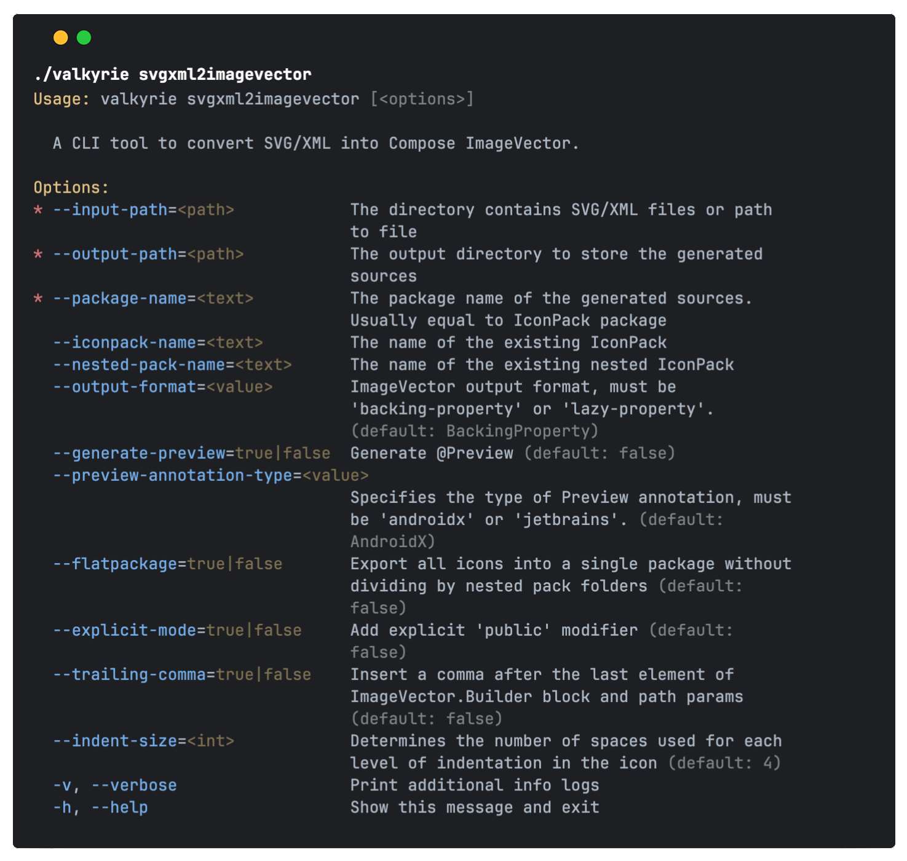
</div>

Demo:

https://github.com/user-attachments/assets/1e1d07bd-080f-4d39-8683-c1c30ef905e8

#### `changelog` command

Additional command to display embedded CLI changelog

Usage:

```bash
./valkyrie changelog
```

<div align="center">
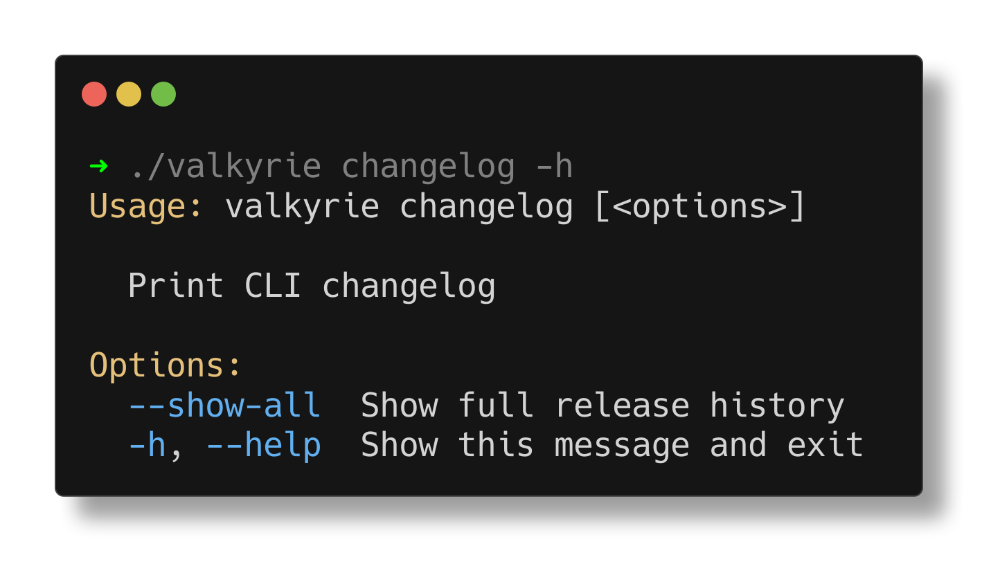
</div>

Output example:

<div align="center">
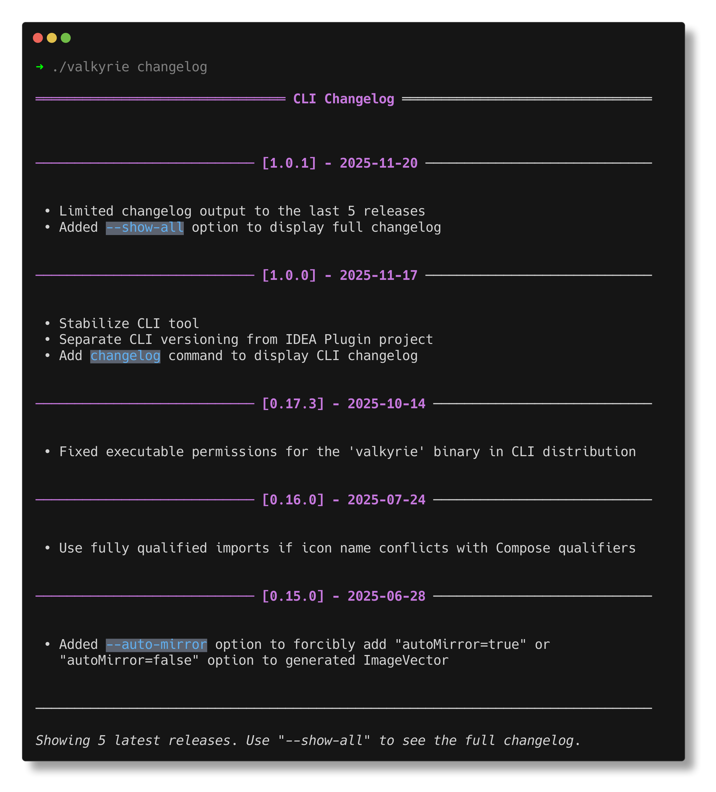
</div>

### Build CLI

Run `./gradlew buildCLI` to build minified version of CLI tool. Artifact will be available in
`tools/cli/build/distributions/valkyrie-cli-*.**.*-SNAPSHOT.zip`.

## 🐘Gradle plugin

The Gradle plugin automates the conversion of SVG/XML files to Compose ImageVector format during the build process. It's
ideal for projects that need to version control icon sources and generate type-safe Kotlin code automatically.

### Common scenarios

- **Team collaboration**: Keep SVG/XML sources in version control and let the build system generate Kotlin code for
  everyone
- **CI/CD pipelines**: Ensure icons are always generated consistently across different environments
- **Design system integration**: Automatically sync icon updates from design tools without manual conversion
- **Large icon libraries**: Efficiently manage hundreds or thousands of icons with minimal manual intervention

### Plugin configuration

#### 1. Apply the plugin

[![Gradle Plugin Portal][badge:gradle-plugin]][url:gradle-plugin]

Define in your libs.versions.toml:

```toml
[plugins]
valkyrie = "io.github.composegears.valkyrie:latest-version"
```

Add the plugin to your `build.gradle.kts`:

```kotlin
plugins {
  alias(libs.plugins.valkyrie)
}
```

#### 2. Configure the plugin

Full gradle plugin API specification (see [practical examples below](#gradle-plugin-samples)):

```kotlin
valkyrie {
  // Required: Package name for generated icons
  // Defaults to Android 'namespace' if Android Gradle Plugin is applied
  packageName = "com.example.app.icons"

  // Optional: Custom output directory (default: build/generated/sources/valkyrie)
  outputDirectory = layout.buildDirectory.dir("generated/valkyrie")

  // Optional: Resource directory name containing icon files (default: "valkyrieResources")
  // Icons will be discovered in src/{sourceSet}/{resourceDirectoryName}/
  // Example: src/commonMain/valkyrieResources/, src/androidMain/valkyrieResources/
  resourceDirectoryName = "valkyrieResources"

  // Optional: Generate during IDE sync for better developer experience (default: false)
  generateAtSync = false

  // Optional: Code style configuration for generated code
  codeStyle {
    // Add explicit `public` modifier to generated declarations (default: false)
    useExplicitMode = false

    // Number of spaces used for each level of indentation in generated code (default: 4)
    indentSize = 4
  }

  // Optional: ImageVector generation configuration
  imageVector {
    // Output format for generated ImageVectors (default: BackingProperty)
    outputFormat = OutputFormat.BackingProperty // or OutputFormat.LazyProperty

    // Use predefined Compose colors instead of hex color codes (e.g. Color.Black instead of Color(0xFF000000)) (default: true)
    useComposeColors = true

    // Generate `@Preview` function for ImageVector (default: false)
    generatePreview = false

    // Specifies the type of Preview annotation to generate for @Preview
    previewAnnotationType = PreviewAnnotationType.AndroidX

    // Insert a trailing comma after the last element of ImageVector.Builder block and path params (default: false)
    addTrailingComma = false
  }

  // Optional icon pack object configuration
  iconPack {
    // Required: Name of the root icon pack object
    name = "ValkyrieIcons"

    // Required: Target source set for generated icon pack object
    targetSourceSet = "commonMain"

    // Optional: Generate flat package structure without subfolders (default: false)
    useFlatPackage = false

    // Optional: Nested icon packs configuration
    nested {
      // Required: Name of the nested icon pack object
      name = "Outlined"

      // Required: The source folder path containing icons for this nested pack, relative to the `resourceDirectoryName`.
      sourceFolder = "outlined"
    }
    // You can add more nested packs if necessary
  }
}
```

#### 3. Organize your icons

Place your icon files in the resources directory:

```text
src/
└── commonMain/
    └── valkyrieResources/
        ├── add.svg
        ├── delete.svg
        └── ic_home.xml
```

The plugin automatically discovers icons from `src/{sourceSet}/valkyrieResources/` in all source sets.

#### 4. Run generation

Run the Gradle task to generate ImageVector sources:

```bash
./gradlew generateValkyrieImageVector
```

### Gradle plugin samples

#### Basic conversion

Simply convert SVG/XML files to ImageVector in the specified package.
For this example, we will use a multiplatform project structure.

```kotlin
plugins {
  kotlin("multiplatform")
  alias(libs.plugins.valkyrie)
}

valkyrie {
  packageName = "com.example.app.icons"
}

// other code
```

Place icons in the `valkyrieResources` directory:

```text
src/
└── commonMain/
    └── valkyrieResources/
        ├── ic_brush.xml
        ├── ic_compose_color.xml
        ├── ic_linear_gradient.svg
        ├── ic_several_path.xml
        └── ic_transparent_fill_color.xml
```

Run the Gradle task:

```bash
./gradlew generateValkyrieImageVector
```

Observe generated code in `build` directory:

<div align="center">
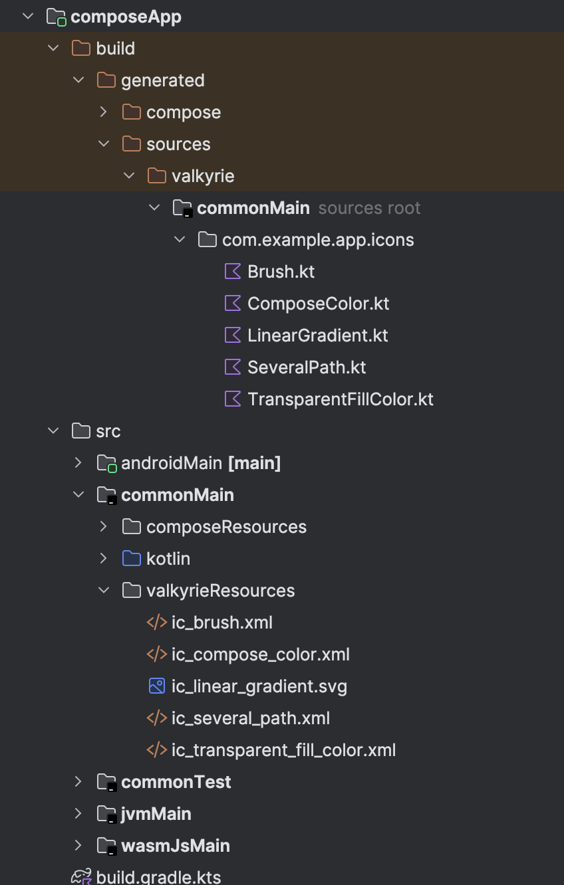
</div>

Use icon from your Compose code:

```kotlin
@Composable
fun Demo() {
  Image(
    imageVector = ComposeColor,
    contentDescription = "Color"
  )
}
```

#### Icon pack configuration

For better organization and type-safe access to your icons, you can create an icon pack.
For this example, we will use a multiplatform project structure.

```kotlin
plugins {
  kotlin("multiplatform")
  alias(libs.plugins.valkyrie)
}

valkyrie {
  packageName = "com.example.app.icons"

  iconPack {
    name = "ValkyrieIcons"
    targetSourceSet = "commonMain" // icon pack object will be generated in commonMain source set
  }
}
```

Place icons in the `valkyrieResources` directory:

```text
src/
└── commonMain/
    └── valkyrieResources/
        ├── ic_brush.xml
        ├── ic_compose_color.xml
        ├── ic_linear_gradient.svg
        ├── ic_several_path.xml
        └── ic_transparent_fill_color.xml
```

Run the Gradle task:

```bash
./gradlew generateValkyrieImageVector
```

Observe generated code in `build` directory with icon pack object and icons:

<div align="center">
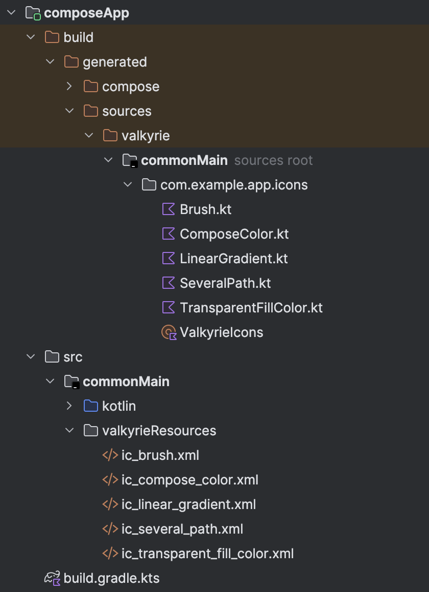
</div>

Use icon from your Compose code:

```kotlin
@Composable
fun Demo() {
  Image(
    imageVector = ValkyrieIcons.LinearGradient,
    contentDescription = null
  )
}
```

#### Icon pack with nested packs configuration

For larger projects with multiple icon sets, you can organize icons into a structured icon pack with nested packs. This
approach provides better organization and type-safe access to your icons.

For this example, we will use a multiplatform project structure.

```kotlin
plugins {
  kotlin("multiplatform")
  alias(libs.plugins.valkyrie)
}

valkyrie {
  packageName = "com.example.app.icons"

  iconPack {
    name = "ValkyrieIcons"
    targetSourceSet = "commonMain"

    nested {
      name = "Outlined"
      sourceFolder = "outlined"
    }

    nested {
      name = "Filled"
      sourceFolder = "filled"
    }
  }
}
```

Organize your icons in nested folders:

```text
src/
└── commonMain/
    └── valkyrieResources/
        ├── outlined/
        │   ├── add.svg
        │   ├── delete.svg
        │   └── settings.svg
        └── filled/
            ├── home.svg
            ├── user.svg
            └── search.svg
```

Run the Gradle task:

```bash
./gradlew generateValkyrieImageVector
```

Observe generated code in `build` directory with icon pack object and icons:

<div align="center">
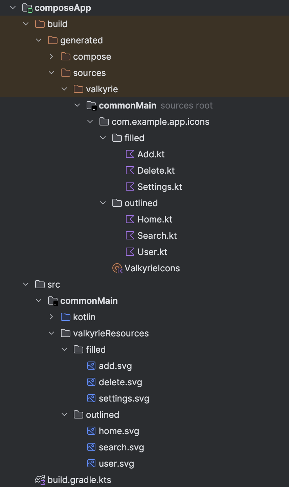
</div>

Use icons from your Compose code:

```kotlin
@Composable
fun Demo() {
  Image(
    imageVector = ValkyrieIcons.Outlined.Add,
    contentDescription = "Add"
  )

  Image(
    imageVector = ValkyrieIcons.Filled.Home,
    contentDescription = "Home"
  )
}
```

### Tips and tricks

#### Copy generated icons into source folder instead of build folder

To keep generated icons in your source folder (e.g. for version control), you can create custom Gradle tasks to sync
the generated files after the generation task.

```kotlin
val copyTask = tasks.register<Copy>("copyValkyrieIcons") {
  dependsOn(tasks.named("generateValkyrieImageVector"))

  from(layout.buildDirectory.dir("generated/sources/valkyrie/commonMain"))
  into(layout.projectDirectory.dir("src/commonMain/kotlin"))
}

val cleanTask = tasks.register<Delete>("cleanValkyrieGenerated") {
  delete(layout.buildDirectory.dir("generated/sources/valkyrie"))
}

tasks.register("updateValkyrieIcons") {
  dependsOn(copyTask)
  finalizedBy(cleanTask)
}
```

## Other

### Export formats

[Original Discussion](https://github.com/ComposeGears/Valkyrie/issues/63)

<table>
<tr>
<td>Backing property</td> 
<td>Lazy property</td>
</tr>
<tr>
<td valign="top"> 

```kotlin
package io.github.composegears.valkyrie.backing.outlined

import androidx.compose.ui.graphics.Color
import androidx.compose.ui.graphics.SolidColor
import androidx.compose.ui.graphics.vector.ImageVector
import androidx.compose.ui.graphics.vector.path
import androidx.compose.ui.unit.dp
import io.github.composegears.valkyrie.backing.BackingIcons

val BackingIcons.Outlined.Add: ImageVector
get() {
  if (_Add != null) {
    return _Add!!
  }
  _Add = ImageVector.Builder(
    name = "Outlined.Add",
    defaultWidth = 24.dp,
    defaultHeight = 24.dp,
    viewportWidth = 24f,
    viewportHeight = 24f,
  ).apply {
    path(fill = SolidColor(Color(0xFF232F34))) {
      moveTo(19f, 13f)
      lineTo(13f, 13f)
      lineTo(13f, 19f)
      lineTo(11f, 19f)
      lineTo(11f, 13f)
      lineTo(5f, 13f)
      lineTo(5f, 11f)
      lineTo(11f, 11f)
      lineTo(11f, 5f)
      lineTo(13f, 5f)
      lineTo(13f, 11f)
      lineTo(19f, 11f)
      lineTo(19f, 13f)
      close()
    }
  }.build()

  return _Add!!
}

@Suppress("ObjectPropertyName")
private var _Add: ImageVector? = null
```

</td>
<td valign="top"> 

```kotlin
package io.github.composegears.valkyrie.lazy.outlined

import androidx.compose.ui.graphics.Color
import androidx.compose.ui.graphics.SolidColor
import androidx.compose.ui.graphics.vector.ImageVector
import androidx.compose.ui.graphics.vector.path
import androidx.compose.ui.unit.dp
import io.github.composegears.valkyrie.lazy.LazyIcons

val LazyIcons.Outlined.Add: ImageVector by lazy(LazyThreadSafetyMode.NONE) {
  ImageVector.Builder(
    name = "Outlined.Add",
    defaultWidth = 24.dp,
    defaultHeight = 24.dp,
    viewportWidth = 24f,
    viewportHeight = 24f,
  ).apply {
    path(fill = SolidColor(Color(0xFF232F34))) {
      moveTo(19f, 13f)
      lineTo(13f, 13f)
      lineTo(13f, 19f)
      lineTo(11f, 19f)
      lineTo(11f, 13f)
      lineTo(5f, 13f)
      lineTo(5f, 11f)
      lineTo(11f, 11f)
      lineTo(11f, 5f)
      lineTo(13f, 5f)
      lineTo(13f, 11f)
      lineTo(19f, 11f)
      lineTo(19f, 13f)
      close()
    }
  }.build()
}
```

</td>
</tr>
</table>

### Comparison with other solutions

Source SVG icon:

```svg

<svg xmlns="http://www.w3.org/2000/svg" height="24px" viewBox="0 0 24 24" width="24px" fill="#e8eaed">
  <path d="M0 0h24v24H0V0z" fill="none"/>
  <path d="M19 13h-6v6h-2v-6H5v-2h6V5h2v6h6v2z"/>
</svg>
```

ImageVector output:

<table>
<tr>
<td>Valkyrie</td>
<td>composables.com</td>
</tr>
<tr>
<td valign="top"> 

```kotlin
package io.github.composegears.valkyrie

import androidx.compose.ui.graphics.Color
import androidx.compose.ui.graphics.SolidColor
import androidx.compose.ui.graphics.vector.ImageVector
import androidx.compose.ui.graphics.vector.path
import androidx.compose.ui.unit.dp

val Add: ImageVector
get() {
  if (_Add != null) {
    return _Add!!
  }
  _Add = ImageVector.Builder(
    name = "Add",
    defaultWidth = 24.dp,
    defaultHeight = 24.dp,
    viewportWidth = 24f,
    viewportHeight = 24f
  ).apply {
    path(fill = SolidColor(Color(0xFFE8EAED))) {
      moveTo(19f, 13f)
      horizontalLineToRelative(-6f)
      verticalLineToRelative(6f)
      horizontalLineToRelative(-2f)
      verticalLineToRelative(-6f)
      horizontalLineTo(5f)
      verticalLineToRelative(-2f)
      horizontalLineToRelative(6f)
      verticalLineTo(5f)
      horizontalLineToRelative(2f)
      verticalLineToRelative(6f)
      horizontalLineToRelative(6f)
      verticalLineToRelative(2f)
      close()
    }
  }.build()

  return _Add!!
}

@Suppress("ObjectPropertyName")
private var _Add: ImageVector? = null

```

</td>
<td>

```kotlin
import androidx.compose.runtime.Composable
import androidx.compose.foundation.Image
import androidx.compose.ui.graphics.SolidColor
import androidx.compose.ui.graphics.Color
import androidx.compose.ui.graphics.StrokeCap
import androidx.compose.ui.graphics.StrokeJoin
import androidx.compose.ui.graphics.vector.ImageVector
import androidx.compose.ui.graphics.PathFillType
import androidx.compose.ui.graphics.vector.path
import androidx.compose.ui.unit.dp

private var _Add: ImageVector? = null

public val Add: ImageVector
get() {
  if (_Add != null) {
    return _Add!!
  }
  _Add = ImageVector.Builder(
    name = "Add",
    defaultWidth = 24.dp,
    defaultHeight = 24.dp,
    viewportWidth = 24f,
    viewportHeight = 24f
  ).apply {
    path(
      fill = null,
      fillAlpha = 1.0f,
      stroke = null,
      strokeAlpha = 1.0f,
      strokeLineWidth = 1.0f,
      strokeLineCap = StrokeCap.Butt,
      strokeLineJoin = StrokeJoin.Miter,
      strokeLineMiter = 1.0f,
      pathFillType = PathFillType.NonZero
    ) {
      moveTo(0f, 0f)
      horizontalLineToRelative(24f)
      verticalLineToRelative(24f)
      horizontalLineTo(0f)
      verticalLineTo(0f)
      close()
    }
    path(
      fill = SolidColor(Color(0xFFE8EAED)),
      fillAlpha = 1.0f,
      stroke = null,
      strokeAlpha = 1.0f,
      strokeLineWidth = 1.0f,
      strokeLineCap = StrokeCap.Butt,
      strokeLineJoin = StrokeJoin.Miter,
      strokeLineMiter = 1.0f,
      pathFillType = PathFillType.NonZero
    ) {
      moveTo(19f, 13f)
      horizontalLineToRelative(-6f)
      verticalLineToRelative(6f)
      horizontalLineToRelative(-2f)
      verticalLineToRelative(-6f)
      horizontalLineTo(5f)
      verticalLineToRelative(-2f)
      horizontalLineToRelative(6f)
      verticalLineTo(5f)
      horizontalLineToRelative(2f)
      verticalLineToRelative(6f)
      horizontalLineToRelative(6f)
      verticalLineToRelative(2f)
      close()
    }
  }.build()
  return _Add!!
}

```

</td>
</tr>
</table>

### Migration guide

#### v0.13.0 -> v0.14.0

CLI options `--iconpack-name` and `--nested-packs` removed in favour of `--iconpack`

Single pack

```text
❌ ./valkyrie --iconpack-name=ValkyrieIcons
```

```text
✅ ./valkyrie --iconpack=ValkyrieIcons
```

Nested packs

```text
❌ ./valkyrie --iconpack-name=ValkyrieIcons --nested-packs=Colored,Filled
```

```text
✅ ./valkyrie --iconpack=ValkyrieIcons.Colored,ValkyrieIcons.Filled
```

## Join our community

<a href="https://join.slack.com/t/composegears/shared_invite/zt-2noleve52-D~zrFPmC1cdhThsuQUW61A">
    
</a>

## Contributors

Thank you for your contributions and support! ❤️

<a href="https://github.com/ComposeGears/Valkyrie/graphs/contributors">
  
</a>

## License

```text
Developed by ComposeGears 2024

Licensed under the Apache License, Version 2.0 (the "License");
you may not use this file except in compliance with the License.
You may obtain a copy of the License at

   http://www.apache.org/licenses/LICENSE-2.0

Unless required by applicable law or agreed to in writing, software
distributed under the License is distributed on an "AS IS" BASIS,
WITHOUT WARRANTIES OR CONDITIONS OF ANY KIND, either express or implied.
See the License for the specific language governing permissions and
limitations under the License.
```

[badge:marketplace-version]: https://img.shields.io/jetbrains/plugin/v/24786?label=JB%20Marketplace&style=for-the-badge&labelColor=black&color=white

[badge:idea-release]: https://img.shields.io/badge/Github%20IDEA%20Plugin-0.18.0-white?style=for-the-badge&labelColor=black

[badge:cli-release]: https://img.shields.io/github/v/release/ComposeGears/Valkyrie?filter=cli-*&style=for-the-badge&label=CLI&labelColor=black&color=white

[badge:homebrew]: https://img.shields.io/badge/homebrew-tap-orange?style=for-the-badge&labelColor=black&color=white&logo=homebrew

[badge:gradle-plugin]: https://img.shields.io/gradle-plugin-portal/v/io.github.composegears.valkyrie?style=for-the-badge&labelColor=black&color=white&label=Gradle%20Plugin

[badge:marketplace-downloads]: https://img.shields.io/jetbrains/plugin/d/24786.svg?style=for-the-badge&labelColor=black&color=white

[badge:marketplace-rating]: https://img.shields.io/jetbrains/plugin/r/rating/24786?style=for-the-badge&labelColor=black&color=white

[badge:slack-invite]: https://img.shields.io/badge/slack-blue.svg?logo=slack&style=for-the-badge&labelColor=black&color=white

[badge:telegram-invite]: https://img.shields.io/badge/Telegram-2CA5E0?logo=telegram&style=for-the-badge&labelColor=black&color=white&logoColor=white

[badge:license]: https://img.shields.io/github/license/ComposeGears/Valkyrie?style=for-the-badge&labelColor=black&color=white

[badge:coverage]: https://img.shields.io/endpoint?url=https://gist.githubusercontent.com/egorikftp/ae91ef6fa6f1837ef39b4f4ac21e91d2/raw/valkyrie-coverage.json&style=for-the-badge&labelColor=black&color=white&label=Test%20Coverage

[url:plugin-homepage]: https://plugins.jetbrains.com/plugin/24786-valkyrie

[url:gh-releases]: https://github.com/ComposeGears/Valkyrie/releases

[url:homebrew]: https://github.com/ComposeGears/homebrew-repo

[url:gradle-plugin]: https://plugins.gradle.org/plugin/io.github.composegears.valkyrie

[url:telegram-invite]: https://t.me/composegears

[url:slack-invite]: https://join.slack.com/t/composegears/shared_invite/zt-2noleve52-D~zrFPmC1cdhThsuQUW61A

[url:gh-license]: https://github.com/ComposeGears/Valkyrie/blob/main/LICENSE
