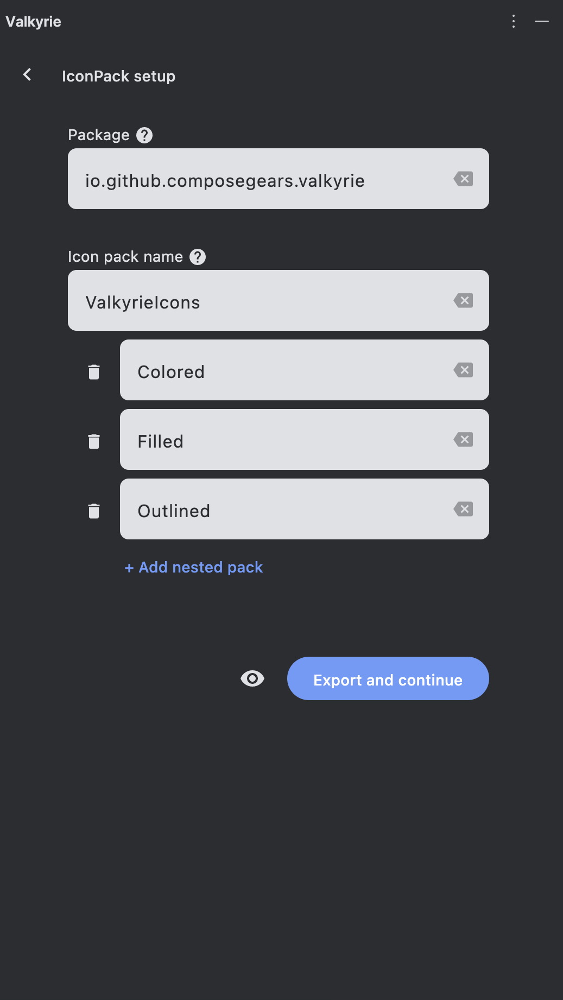
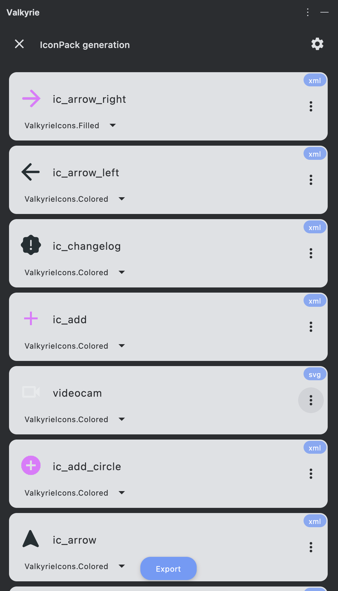

[![Plugin Homepage][badge:plugin-homepage]][plugin-homepage]
[![License][badge:license]][gh:license]
[![GitHub releases][badge:release]][gh:releases]
[![Version][badge:version]][plugin-versions]
[![Downloads][badge:downloads]][plugin-homepage]

<div align="center">
    
</div>

<h1 align="center">Valkyrie</h1>
<h2 align="center">Intellij IDEA / Android Studio plugin to generate Compose ImageVector from SVG/XML</h2>

## Key features

- built using [Compose Multiplatform](https://github.com/JetBrains/compose-multiplatform)
  and [Tiamat](https://github.com/ComposeGears/Tiamat) navigation library
- support SVG/XML
- convenient code formatting for generated icon
  - remove redundant code
  - remove unused imports 
  - skip default ImageVector parameters
- support drag and drop inside IDE

##  Conversion modes:

### **Simple** - one-click solution to convert SVG/XML to ImageVector
Allows previewing the generated icon and facilitates copying the result directly to the clipboard for easy integration into your project.

 

Demo:


https://github.com/ComposeGears/Valkyrie/assets/16294951/1c5ca6ef-4240-4916-b523-cf9bb15a7422


### **IconPack** - create your organized icon pack and auto export icons into your directory

Allows to create organized icon pack with an extension property of you pack object and batch export into your specified directory.

 

Demo:


https://github.com/ComposeGears/Valkyrie/assets/16294951/5ad9cb33-cef2-46dd-9f0c-638583a90385


## Comparison

Source SVG icon:
```svg
<svg xmlns="http://www.w3.org/2000/svg" height="24px" viewBox="0 0 24 24" width="24px" fill="#e8eaed"><path d="M0 0h24v24H0V0z" fill="none"/><path d="M19 13h-6v6h-2v-6H5v-2h6V5h2v6h6v2z"/></svg>
```

ImageVector output: 

<table>
<tr>
<td> Valkyrie </td> <td> composables.com </td>
</tr>
<tr>
<td valign="top"> 

```kotlin
package io.github.composegears.valkyrie

import androidx.compose.ui.graphics.Color
import androidx.compose.ui.graphics.SolidColor
import androidx.compose.ui.graphics.vector.ImageVector
import androidx.compose.ui.graphics.vector.path
import androidx.compose.ui.unit.dp

val Add: ImageVector
  get() {
    if (_Add != null) {
      return _Add!!
    }
    _Add = ImageVector.Builder(
      name = "Add",
      defaultWidth = 24.dp,
      defaultHeight = 24.dp,
      viewportWidth = 24f,
      viewportHeight = 24f
    ).apply {
      path(fill = SolidColor(Color(0xFFE8EAED))) {
        moveTo(19f, 13f)
        horizontalLineToRelative(-6f)
        verticalLineToRelative(6f)
        horizontalLineToRelative(-2f)
        verticalLineToRelative(-6f)
        horizontalLineTo(5f)
        verticalLineToRelative(-2f)
        horizontalLineToRelative(6f)
        verticalLineTo(5f)
        horizontalLineToRelative(2f)
        verticalLineToRelative(6f)
        horizontalLineToRelative(6f)
        verticalLineToRelative(2f)
        close()
      }
    }.build()

    return _Add!!
  }

private var _Add: ImageVector? = null

```

</td>
<td>

```kotlin
import androidx.compose.runtime.Composable
import androidx.compose.foundation.Image
import androidx.compose.ui.graphics.SolidColor
import androidx.compose.ui.graphics.Color
import androidx.compose.ui.graphics.StrokeCap
import androidx.compose.ui.graphics.StrokeJoin
import androidx.compose.ui.graphics.vector.ImageVector
import androidx.compose.ui.graphics.PathFillType
import androidx.compose.ui.graphics.vector.path
import androidx.compose.ui.unit.dp

private var _Add: ImageVector? = null

public val Add: ImageVector
  get() {
    if (_Add != null) {
      return _Add!!
    }
    _Add = ImageVector.Builder(
      name = "Add",
      defaultWidth = 24.dp,
      defaultHeight = 24.dp,
      viewportWidth = 24f,
      viewportHeight = 24f
    ).apply {
      path(
        fill = null,
        fillAlpha = 1.0f,
        stroke = null,
        strokeAlpha = 1.0f,
        strokeLineWidth = 1.0f,
        strokeLineCap = StrokeCap.Butt,
        strokeLineJoin = StrokeJoin.Miter,
        strokeLineMiter = 1.0f,
        pathFillType = PathFillType.NonZero
      ) {
        moveTo(0f, 0f)
        horizontalLineToRelative(24f)
        verticalLineToRelative(24f)
        horizontalLineTo(0f)
        verticalLineTo(0f)
        close()
      }
      path(
        fill = SolidColor(Color(0xFFE8EAED)),
        fillAlpha = 1.0f,
        stroke = null,
        strokeAlpha = 1.0f,
        strokeLineWidth = 1.0f,
        strokeLineCap = StrokeCap.Butt,
        strokeLineJoin = StrokeJoin.Miter,
        strokeLineMiter = 1.0f,
        pathFillType = PathFillType.NonZero
      ) {
        moveTo(19f, 13f)
        horizontalLineToRelative(-6f)
        verticalLineToRelative(6f)
        horizontalLineToRelative(-2f)
        verticalLineToRelative(-6f)
        horizontalLineTo(5f)
        verticalLineToRelative(-2f)
        horizontalLineToRelative(6f)
        verticalLineTo(5f)
        horizontalLineToRelative(2f)
        verticalLineToRelative(6f)
        horizontalLineToRelative(6f)
        verticalLineToRelative(2f)
        close()
      }
    }.build()
    return _Add!!
  }

```

</td>
</tr>
</table>

## Requirements

- Intellij IDEA 2024.1+
- Android Studio Koala+

## Installation

<a href="https://plugins.jetbrains.com/plugin/24786-valkyrie" target="_blank">
    
</a>

- **Find plugin inside IDE**:

  <kbd>Settings/Preferences</kbd> > <kbd>Plugins</kbd> > <kbd>Marketplace</kbd> > <kbd>Search for <b>"Valkyrie"</b></kbd> >
  <kbd>Install Plugin</kbd>

- **Manually**:
  Download the [latest release](https://github.com/ComposeGears/Valkyrie/releases/latest)
  or [build your self](#Building) and install it manually using
  <kbd>Settings</kbd> -> <kbd>Plugins</kbd> -> <kbd>⚙️</kbd> -> <kbd>Install plugin from disk...</kbd>

## Building

Use `./gradlew buildPlugin` to build plugin locally. Artifact will be available in `idea-plugin/build/distributions/` path

other available gradle commands:

- run plugin in IDE: `./gradlew runIde`

- check dependencies: `./gradlew dependencyUpdates`

- run tests: `./gradlew test`

## License

```
Developed by ComposeGears 2024

Licensed under the Apache License, Version 2.0 (the "License");
you may not use this file except in compliance with the License.
You may obtain a copy of the License at

   http://www.apache.org/licenses/LICENSE-2.0

Unless required by applicable law or agreed to in writing, software
distributed under the License is distributed on an "AS IS" BASIS,
WITHOUT WARRANTIES OR CONDITIONS OF ANY KIND, either express or implied.
See the License for the specific language governing permissions and
limitations under the License.
```

[badge:plugin-homepage]: https://img.shields.io/badge/plugin%20homepage-Valkyrie-24786.svg?style=flat-square

[badge:license]: https://img.shields.io/github/license/ComposeGears/Valkyrie.svg?style=flat-square
[badge:release]: https://img.shields.io/github/release/ComposeGears/Valkyrie.svg?sort=semver&style=flat-square&colorB=0097A7
[badge:version]: https://img.shields.io/jetbrains/plugin/v/24786.svg?style=flat-square&colorB=2196F3
[badge:downloads]: https://img.shields.io/jetbrains/plugin/d/24786.svg?style=flat-square&colorB=5C6BC0

[gh:releases]: https://github.com/ComposeGears/Valkyrie/releases
[gh:license]: https://github.com/ComposeGears/Valkyrie/blob/main/LICENSE

[plugin-homepage]: https://plugins.jetbrains.com/plugin/24786-valkyrie
[plugin-versions]: https://plugins.jetbrains.com/plugin/24786-valkyrie/versions