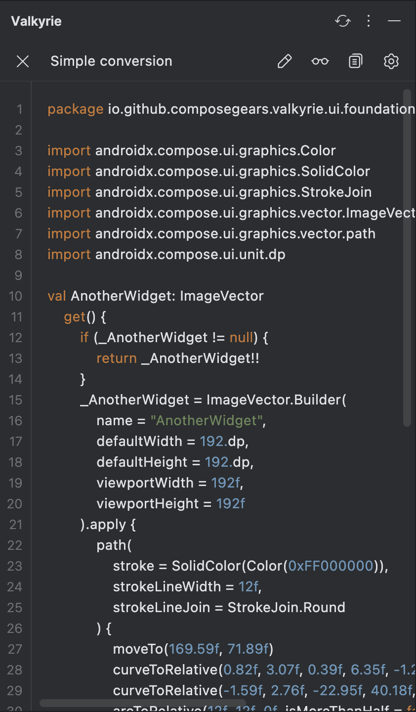

[![Plugin Homepage][badge:plugin-homepage]][plugin-homepage]
[![Version][badge:version]][plugin-versions]
[![GitHub releases][badge:release]][gh:releases]
[![Downloads][badge:downloads]][plugin-homepage]
[![License][badge:license]][gh:license]
[![Downloads][badge:slack]][slack-invite]

<div align="center">
    
</div>

<h1 align="center">Valkyrie</h1>
<h2 align="center">Intellij IDEA / Android Studio plugin to generate Compose ImageVector from SVG/XML</h2>

## Key features

- Support conversion from SVG and XML
- Streamlined code formatting for generated icon:
  * remove redundant code (e.g. `public` keyword)
  * remove unused imports
  * skip default ImageVector parameters
  * support generation as [Backing property or Lazy property](#export-formats)
- Two conversion modes: [Simple](#simple-mode) and [IconPack](#iconpack-mode)
- Build-in ImageVector previewer with basic zoom and change background actions
- Built using [Compose Multiplatform](https://github.com/JetBrains/compose-multiplatform) and [Tiamat](https://github.com/ComposeGears/Tiamat) navigation library

## **Simple mode**

> [!NOTE]
> One-click solution to convert SVG/XML to ImageVector (requires only specifying the package).
> Enables previewing the generated icon and easily copying the result to the clipboard for seamless integration into
> your project.

<div align="center">
    
    
</div>


Live demo:

https://github.com/user-attachments/assets/15ee9356-0db3-4b87-b4fe-23bb6bba70a0

## **IconPack mode**

### **New icon pack**

> [!NOTE]
> Facilitates creating an organized icon pack with extension properties for your pack `object`, previewing the list of
> icons, and batch exporting them to your specified directory.

<div align="center">
    
    
</div>

Live demo:

https://github.com/user-attachments/assets/ccb568a4-bda9-4f2b-bf40-29b1a8e4c854

### **Existing icon pack**

> [!NOTE]
> Instead of importing icon pack settings, the plugin provides a direct way to import an already created icon pack from
> a Kotlin file.

<div align="center">
    
    
</div>

> [!IMPORTANT]
> Currently, editing features are limited; you can only load an existing pack and add more nested packs.

Live demo:

https://github.com/user-attachments/assets/77f449dd-a6d0-44ea-9059-b7b30ee94426

## Export formats

[Original Discussion](https://github.com/ComposeGears/Valkyrie/issues/63)

<table>
<tr>
<td>Backing property</td> 
<td>Lazy property</td>
</tr>
<tr>
<td valign="top"> 

```kotlin
package io.github.composegears.valkyrie.playground.icons.backing.outlined

import androidx.compose.ui.graphics.Color
import androidx.compose.ui.graphics.SolidColor
import androidx.compose.ui.graphics.vector.ImageVector
import androidx.compose.ui.graphics.vector.path
import androidx.compose.ui.unit.dp
import io.github.composegears.valkyrie.playground.icons.backing.BackingIcons

val BackingIcons.Outlined.Add: ImageVector
  get() {
    if (_Add != null) {
      return _Add!!
    }
    _Add = ImageVector.Builder(
      name = "Outlined.Add",
      defaultWidth = 24.dp,
      defaultHeight = 24.dp,
      viewportWidth = 24f,
      viewportHeight = 24f,
    ).apply {
      path(fill = SolidColor(Color(0xFF232F34))) {
        moveTo(19f, 13f)
        lineTo(13f, 13f)
        lineTo(13f, 19f)
        lineTo(11f, 19f)
        lineTo(11f, 13f)
        lineTo(5f, 13f)
        lineTo(5f, 11f)
        lineTo(11f, 11f)
        lineTo(11f, 5f)
        lineTo(13f, 5f)
        lineTo(13f, 11f)
        lineTo(19f, 11f)
        lineTo(19f, 13f)
        close()
      }
    }.build()

    return _Add!!
  }

@Suppress("ObjectPropertyName")
private var _Add: ImageVector? = null
```

</td>
<td valign="top"> 

```kotlin
package io.github.composegears.valkyrie.playground.icons.lazy.outlined

import androidx.compose.ui.graphics.Color
import androidx.compose.ui.graphics.SolidColor
import androidx.compose.ui.graphics.vector.ImageVector
import androidx.compose.ui.graphics.vector.path
import androidx.compose.ui.unit.dp
import io.github.composegears.valkyrie.playground.icons.lazy.LazyIcons
import kotlin.LazyThreadSafetyMode

val LazyIcons.Outlined.Add: ImageVector by lazy(LazyThreadSafetyMode.NONE) {
  ImageVector.Builder(
    name = "Outlined.Add",
    defaultWidth = 24.dp,
    defaultHeight = 24.dp,
    viewportWidth = 24f,
    viewportHeight = 24f,
  ).apply {
    path(fill = SolidColor(Color(0xFF232F34))) {
      moveTo(19f, 13f)
      lineTo(13f, 13f)
      lineTo(13f, 19f)
      lineTo(11f, 19f)
      lineTo(11f, 13f)
      lineTo(5f, 13f)
      lineTo(5f, 11f)
      lineTo(11f, 11f)
      lineTo(11f, 5f)
      lineTo(13f, 5f)
      lineTo(13f, 11f)
      lineTo(19f, 11f)
      lineTo(19f, 13f)
      close()
    }
  }.build()
}
```

</td>
</tr>
</table>

## Comparison with other solutions

Source SVG icon:

```svg
<svg xmlns="http://www.w3.org/2000/svg" height="24px" viewBox="0 0 24 24" width="24px" fill="#e8eaed">
  <path d="M0 0h24v24H0V0z" fill="none"/>
  <path d="M19 13h-6v6h-2v-6H5v-2h6V5h2v6h6v2z"/>
</svg>
```

ImageVector output:

<table>
<tr>
<td>Valkyrie</td>
<td>composables.com</td>
</tr>
<tr>
<td valign="top"> 

```kotlin
package io.github.composegears.valkyrie

import androidx.compose.ui.graphics.Color
import androidx.compose.ui.graphics.SolidColor
import androidx.compose.ui.graphics.vector.ImageVector
import androidx.compose.ui.graphics.vector.path
import androidx.compose.ui.unit.dp
import kotlin.Suppress

val Add: ImageVector
  get() {
    if (_Add != null) {
      return _Add!!
    }
    _Add = ImageVector.Builder(
      name = "Add",
      defaultWidth = 24.dp,
      defaultHeight = 24.dp,
      viewportWidth = 24f,
      viewportHeight = 24f
    ).apply {
      path(fill = SolidColor(Color(0xFFE8EAED))) {
        moveTo(19f, 13f)
        horizontalLineToRelative(-6f)
        verticalLineToRelative(6f)
        horizontalLineToRelative(-2f)
        verticalLineToRelative(-6f)
        horizontalLineTo(5f)
        verticalLineToRelative(-2f)
        horizontalLineToRelative(6f)
        verticalLineTo(5f)
        horizontalLineToRelative(2f)
        verticalLineToRelative(6f)
        horizontalLineToRelative(6f)
        verticalLineToRelative(2f)
        close()
      }
    }.build()

    return _Add!!
  }

@Suppress("ObjectPropertyName")
private var _Add: ImageVector? = null

```

</td>
<td>

```kotlin
import androidx.compose.runtime.Composable
import androidx.compose.foundation.Image
import androidx.compose.ui.graphics.SolidColor
import androidx.compose.ui.graphics.Color
import androidx.compose.ui.graphics.StrokeCap
import androidx.compose.ui.graphics.StrokeJoin
import androidx.compose.ui.graphics.vector.ImageVector
import androidx.compose.ui.graphics.PathFillType
import androidx.compose.ui.graphics.vector.path
import androidx.compose.ui.unit.dp

private var _Add: ImageVector? = null

public val Add: ImageVector
  get() {
    if (_Add != null) {
      return _Add!!
    }
    _Add = ImageVector.Builder(
      name = "Add",
      defaultWidth = 24.dp,
      defaultHeight = 24.dp,
      viewportWidth = 24f,
      viewportHeight = 24f
    ).apply {
      path(
        fill = null,
        fillAlpha = 1.0f,
        stroke = null,
        strokeAlpha = 1.0f,
        strokeLineWidth = 1.0f,
        strokeLineCap = StrokeCap.Butt,
        strokeLineJoin = StrokeJoin.Miter,
        strokeLineMiter = 1.0f,
        pathFillType = PathFillType.NonZero
      ) {
        moveTo(0f, 0f)
        horizontalLineToRelative(24f)
        verticalLineToRelative(24f)
        horizontalLineTo(0f)
        verticalLineTo(0f)
        close()
      }
      path(
        fill = SolidColor(Color(0xFFE8EAED)),
        fillAlpha = 1.0f,
        stroke = null,
        strokeAlpha = 1.0f,
        strokeLineWidth = 1.0f,
        strokeLineCap = StrokeCap.Butt,
        strokeLineJoin = StrokeJoin.Miter,
        strokeLineMiter = 1.0f,
        pathFillType = PathFillType.NonZero
      ) {
        moveTo(19f, 13f)
        horizontalLineToRelative(-6f)
        verticalLineToRelative(6f)
        horizontalLineToRelative(-2f)
        verticalLineToRelative(-6f)
        horizontalLineTo(5f)
        verticalLineToRelative(-2f)
        horizontalLineToRelative(6f)
        verticalLineTo(5f)
        horizontalLineToRelative(2f)
        verticalLineToRelative(6f)
        horizontalLineToRelative(6f)
        verticalLineToRelative(2f)
        close()
      }
    }.build()
    return _Add!!
  }

```

</td>
</tr>
</table>

## Requirements

- IntelliJ IDEA 2024.1+
- Android Studio Koala+

> [!IMPORTANT]
> K2 mode is available starting from IntelliJ IDEA 2024.2.1 ([more details](https://kotlin.github.io/analysis-api/migrating-from-k1.html#declaring-compatibility-with-the-k2-kotlin-mode))

## Installation

<a href="https://plugins.jetbrains.com/plugin/24786-valkyrie" target="_blank">
    
</a>

- **Find plugin inside IDE**:

  <kbd>Settings/Preferences</kbd> > <kbd>Plugins</kbd> > <kbd>Marketplace</kbd> > <kbd>Search for <b>"
  Valkyrie"</b></kbd> >
  <kbd>Install Plugin</kbd>

- **Manually**:
  Download the [latest release](https://github.com/ComposeGears/Valkyrie/releases/latest)
  or [build your self](#Building) and install it manually using
  <kbd>Settings</kbd> -> <kbd>Plugins</kbd> -> <kbd>⚙️</kbd> -> <kbd>Install plugin from disk...</kbd>

## Building

Use `./gradlew buildPlugin` to build plugin locally. Artifact will be available in `idea-plugin/build/distributions/`
path

other available gradle commands:

- run plugin in IDE: `./gradlew runIde`

- run tests: `./gradlew test`

- check code style: `./gradlew spotlessCheck`

- apply formatting: `./gradlew spotlessApply`

## Join our community

<a href="https://join.slack.com/t/composegears/shared_invite/zt-2noleve52-D~zrFPmC1cdhThsuQUW61A">
    
</a>

## Contributors

Thank you for your help! ❤️

<a href="https://github.com/ComposeGears/Valkyrie/graphs/contributors">
  
</a>

## License

```
Developed by ComposeGears 2024

Licensed under the Apache License, Version 2.0 (the "License");
you may not use this file except in compliance with the License.
You may obtain a copy of the License at

   http://www.apache.org/licenses/LICENSE-2.0

Unless required by applicable law or agreed to in writing, software
distributed under the License is distributed on an "AS IS" BASIS,
WITHOUT WARRANTIES OR CONDITIONS OF ANY KIND, either express or implied.
See the License for the specific language governing permissions and
limitations under the License.
```

[badge:plugin-homepage]: https://img.shields.io/badge/Jetbrains_Marketplace-Valkyrie-24786.svg

[badge:license]: https://img.shields.io/github/license/ComposeGears/Valkyrie.svg

[badge:release]: https://img.shields.io/github/release/ComposeGears/Valkyrie.svg?sort=semver&colorB=0097A7

[badge:version]: https://img.shields.io/jetbrains/plugin/v/24786.svg?colorB=2196F3

[badge:downloads]: https://img.shields.io/jetbrains/plugin/d/24786.svg?colorB=5C6BC0

[badge:slack]: https://img.shields.io/badge/slack-Compose_Gears-blue.svg?logo=slack

[gh:releases]: https://github.com/ComposeGears/Valkyrie/releases

[gh:license]: https://github.com/ComposeGears/Valkyrie/blob/main/LICENSE

[plugin-homepage]: https://plugins.jetbrains.com/plugin/24786-valkyrie

[plugin-versions]: https://plugins.jetbrains.com/plugin/24786-valkyrie/versions

[slack-invite]: https://join.slack.com/t/composegears/shared_invite/zt-2noleve52-D~zrFPmC1cdhThsuQUW61A
