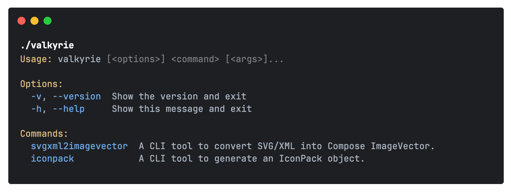

<h2 align="center">Valkyrie — SVG/XML to Compose ImageVector converter</h2>

<div align="center">
    
</div>

<div align="center">

[![Marketplace version][badge:marketplace-version]][url:plugin-homepage]
[![GitHub releases][badge:gh-release]][url:gh-releases]
[![Downloads][badge:marketplace-downloads]][url:plugin-homepage]

[![Telegram][badge:telegram-invite]][url:telegram-invite]
[![Slack][badge:slack-invite]][url:slack-invite]
[![License][badge:license]][url:gh-license]

</div>

## Motivation

On one of the projects, during the migration to Jetpack Compose, we needed to convert a large number of icons from XML (
Android drawable) and SVG (Figma design system) to ImageVector. The existing solutions didn't quite fit our needs due to
their inconvenient workflow, numerous bugs, poor output code, and in some cases, even being paid (after 5 icons 😄).

Additionally, with the release of Compose 1.7.0,
Google [discontinued](https://android-review.googlesource.com/c/platform/frameworks/support/+/3109060) support for
material icons.

## Table of Contents

- [Key features](#key-features)
- 🔌 [IDEA plugin](#idea-plugin)
  - [Plugin features](#plugin-features)
  - [Simple mode](#simple-mode)
  - [IconPack mode](#iconpack-mode)
    - [Create new icon pack](#new-icon-pack)
    - [Update existing icon pack](#existing-icon-pack)
  - [ImageVector previewer](#imagevector-previewer)
  - [Requirements](#requirements)
  - [Installation](#installation)
  - [Build plugin](#build-plugin)
- 🖥️ [CLI tool](#cli-tool)
  - [Install](#install-cli)
  - [Available commands](#available-commands)
    - [`iconpack` command](#iconpack-command)
    - [`svgxml2imagevector` command](#svgxml2imagevector-command)
  - [Build](#build-cli)
- [Other](#other)
  - [Export formats](#export-formats)
  - [Comparison with other solutions](#comparison-with-other-solutions)
  - [Gradle commands](#gradle-commands)
  - [Migration guide](#migration-guide)

## Key features

### Core functionality:

- Support conversion from SVG and XML
- Custom [kotlinpoet](https://github.com/square/kotlinpoet) generator with streamlined code formatting:
  * code alignment and formatting
  * remove redundant code by default (e.g. `public` keyword)
  * remove unused imports (e.g. `kotlin.*` package)
  * skip default ImageVector parameters
  * support generation as [backing property or lazy property](#export-formats)
  * optional trailing comma and explicit mode
  * customize code indent
- Ability to create your unique project icon pack (+nested packs if necessary)
- High performance (6k icons processing ~5sec)

### Currently supported:

- IntelliJ IDEA / Android Studio plugin
- CLI tool
- Gradle plugin and Web app (🚧 coming soon 🚧)

## IDEA Plugin

### Plugin features

- Two conversion modes: [Simple](#simple-mode) and [IconPack](#iconpack-mode)
- Support for Drag&Drop files/directories and pasting content from clipboard
- Easy option to add more icons into existing project icon pack
- Export generated ImageVector to clipboard or file (depends on the mode)
- Fully customizable setting for generated icons
- Build-in [ImageVector previewer](#imagevector-previewer) for any icons without compilation ✨
- The plugin is completely built using [Compose Multiplatform](https://github.com/JetBrains/compose-multiplatform)
  and [Tiamat](https://github.com/ComposeGears/Tiamat) navigation library

More exclusive features under development, stay tuned 🌚

### **Simple mode**

> [!NOTE]
> One-click solution to convert SVG/XML to ImageVector (requires only specifying the package).

#### Available quick actions:

- Rename icon
- Preview current ImageVector
- Copy generated ImageVector to clipboard

<div align="center">
    
    
    
</div>


Demo:

https://github.com/user-attachments/assets/f48eb027-ccb2-4194-87bb-868c6be222ae

### **IconPack mode**

#### **New icon pack**

> [!NOTE]
> Facilitates creating an organized icon pack with extension properties for your pack `object`, previewing the list of
> icons, and batch exporting them to your specified directory.

<div align="center">
    
    
</div>

Demo:

https://github.com/user-attachments/assets/ccb568a4-bda9-4f2b-bf40-29b1a8e4c854

#### **Existing icon pack**

> [!NOTE]
> Instead of importing icon pack settings, the plugin provides a direct way to import an already created icon pack from
> a Kotlin file.

<div align="center">
    
    
</div>

> [!IMPORTANT]
> Editing features are limited for now; you can only load an existing pack and add more nested packs.

Demo:

https://github.com/user-attachments/assets/77f449dd-a6d0-44ea-9059-b7b30ee94426

### ImageVector Previewer

We personally find it very useful to have a previewer for ImageVector (such we have for SVG or XML).
Previewer available for any ImageVector formats (backing or lazy property, legacy google material icons) without
compose @Preview annotation and project compilation.

<div align="center">
    
</div>

Previewer actions:

- Change icon background (pixel grid, white, black)
- Zoom in, zoom out icon without loosing quality
- Draw as actual size
- Fit icon to window

Demo:

https://github.com/user-attachments/assets/1047a2b3-81ec-4e10-a118-0ff20bd5227b

### Requirements

- IntelliJ IDEA 2024.1 and later
- Android Studio Koala and later

> [!IMPORTANT]
> K2 mode is available starting from IntelliJ IDEA
>
2024.2.1 ([more details](https://kotlin.github.io/analysis-api/migrating-from-k1.html#declaring-compatibility-with-the-k2-kotlin-mode))

### Installation

<a href="https://plugins.jetbrains.com/plugin/24786-valkyrie" target="_blank">
    
</a>

- **Find plugin inside IDE**:

  <kbd>Settings</kbd> > <kbd>Plugins</kbd> > <kbd>Marketplace</kbd> > <kbd>Search for <b>"Valkyrie"</b></kbd> >
  <kbd>Install Plugin</kbd>

- **Manually**:
  Download the [latest release](https://github.com/ComposeGears/Valkyrie/releases/latest)
  or [build your self](#build-plugin) and install it manually using
  <kbd>Settings</kbd> -> <kbd>Plugins</kbd> -> <kbd>⚙️</kbd> -> <kbd>Install plugin from disk...</kbd>

### Build plugin

Precondition: IntelliJ IDEA with installed [Plugin DevKit](https://plugins.jetbrains.com/plugin/22851-plugin-devkit)

Run `./gradlew buildPlugin` to build plugin locally. Artifact will be available in `idea-plugin/build/distributions/`
folder

or run plugin in IDE using: `./gradlew runIde`

## CLI tool

CLI tools can be easily integrated into scripts and automated workflows, allowing you to convert icons from specific
source with predefined settings.

### Install CLI

- #### via brew

```shell
  brew install ComposeGears/repo/valkyrie
```

- #### manually via binary release

Download latest CLI tool from [releases](https://github.com/ComposeGears/Valkyrie/releases).

Unzip the downloaded archive and run the CLI tool from `bin` folder in the terminal

```shell
  ./valkyrie
```

You should see this message
<div align="center">

</div>

- #### automatically using bash script

A simple example of how to get the latest version of the CLI tool. It can be executed on CI/CD with predefined
parameters.

```shell

#!/bin/bash

TARGET_DIR="valkyrie-cli"
ASSET_NAME="tmp.zip"

LATEST_CLI_RELEASE_URL=$(curl --silent "https://api.github.com/repos/ComposeGears/Valkyrie/releases/latest" \
  | jq -r '.assets[] | select(.name | startswith("valkyrie-cli")) | .browser_download_url')

curl -L -o "$ASSET_NAME" "$LATEST_CLI_RELEASE_URL"
mkdir -p "$TARGET_DIR"
unzip -o "$ASSET_NAME" -d "$TARGET_DIR"

rm "$ASSET_NAME"

cd "$TARGET_DIR/bin" || exit
./valkyrie svgxml2imagevector -h
```

### Available commands

#### `iconpack` command

A part of the CLI tool that allows you to create an icon pack with nested packs.

Usage:

```shell
  ./valkyrie iconpack [<options>]
```

<div align="center">

</div>

Demo:

https://github.com/user-attachments/assets/dc56f3e6-6831-4230-a8cc-a0c486d4c288

#### `svgxml2imagevector` command

A part of the CLI tool that allows you to convert SVG/XML files to ImageVector.

Usage:

```shell
  ./valkyrie svgxml2imagevector [<options>]
```

<div align="center">

</div>

Demo:

https://github.com/user-attachments/assets/1e1d07bd-080f-4d39-8683-c1c30ef905e8

### Build CLI

Run `./gradlew buildCLI` to build minified version of CLI tool. Artifact will be available in
`cli/build/distributions/valkyrie-cli-*.**.*-SNAPSHOT.zip`.

## Other

### Export formats

[Original Discussion](https://github.com/ComposeGears/Valkyrie/issues/63)

<table>
<tr>
<td>Backing property</td> 
<td>Lazy property</td>
</tr>
<tr>
<td valign="top"> 

```kotlin
package io.github.composegears.valkyrie.backing.outlined

import androidx.compose.ui.graphics.Color
import androidx.compose.ui.graphics.SolidColor
import androidx.compose.ui.graphics.vector.ImageVector
import androidx.compose.ui.graphics.vector.path
import androidx.compose.ui.unit.dp
import io.github.composegears.valkyrie.backing.BackingIcons

val BackingIcons.Outlined.Add: ImageVector
get() {
  if (_Add != null) {
    return _Add!!
  }
  _Add = ImageVector.Builder(
    name = "Outlined.Add",
    defaultWidth = 24.dp,
    defaultHeight = 24.dp,
    viewportWidth = 24f,
    viewportHeight = 24f,
  ).apply {
    path(fill = SolidColor(Color(0xFF232F34))) {
      moveTo(19f, 13f)
      lineTo(13f, 13f)
      lineTo(13f, 19f)
      lineTo(11f, 19f)
      lineTo(11f, 13f)
      lineTo(5f, 13f)
      lineTo(5f, 11f)
      lineTo(11f, 11f)
      lineTo(11f, 5f)
      lineTo(13f, 5f)
      lineTo(13f, 11f)
      lineTo(19f, 11f)
      lineTo(19f, 13f)
      close()
    }
  }.build()

  return _Add!!
}

@Suppress("ObjectPropertyName")
private var _Add: ImageVector? = null
```

</td>
<td valign="top"> 

```kotlin
package io.github.composegears.valkyrie.lazy.outlined

import androidx.compose.ui.graphics.Color
import androidx.compose.ui.graphics.SolidColor
import androidx.compose.ui.graphics.vector.ImageVector
import androidx.compose.ui.graphics.vector.path
import androidx.compose.ui.unit.dp
import io.github.composegears.valkyrie.lazy.LazyIcons

val LazyIcons.Outlined.Add: ImageVector by lazy(LazyThreadSafetyMode.NONE) {
  ImageVector.Builder(
    name = "Outlined.Add",
    defaultWidth = 24.dp,
    defaultHeight = 24.dp,
    viewportWidth = 24f,
    viewportHeight = 24f,
  ).apply {
    path(fill = SolidColor(Color(0xFF232F34))) {
      moveTo(19f, 13f)
      lineTo(13f, 13f)
      lineTo(13f, 19f)
      lineTo(11f, 19f)
      lineTo(11f, 13f)
      lineTo(5f, 13f)
      lineTo(5f, 11f)
      lineTo(11f, 11f)
      lineTo(11f, 5f)
      lineTo(13f, 5f)
      lineTo(13f, 11f)
      lineTo(19f, 11f)
      lineTo(19f, 13f)
      close()
    }
  }.build()
}
```

</td>
</tr>
</table>

### Comparison with other solutions

Source SVG icon:

```svg

<svg xmlns="http://www.w3.org/2000/svg" height="24px" viewBox="0 0 24 24" width="24px" fill="#e8eaed">
  <path d="M0 0h24v24H0V0z" fill="none"/>
  <path d="M19 13h-6v6h-2v-6H5v-2h6V5h2v6h6v2z"/>
</svg>
```

ImageVector output:

<table>
<tr>
<td>Valkyrie</td>
<td>composables.com</td>
</tr>
<tr>
<td valign="top"> 

```kotlin
package io.github.composegears.valkyrie

import androidx.compose.ui.graphics.Color
import androidx.compose.ui.graphics.SolidColor
import androidx.compose.ui.graphics.vector.ImageVector
import androidx.compose.ui.graphics.vector.path
import androidx.compose.ui.unit.dp

val Add: ImageVector
get() {
  if (_Add != null) {
    return _Add!!
  }
  _Add = ImageVector.Builder(
    name = "Add",
    defaultWidth = 24.dp,
    defaultHeight = 24.dp,
    viewportWidth = 24f,
    viewportHeight = 24f
  ).apply {
    path(fill = SolidColor(Color(0xFFE8EAED))) {
      moveTo(19f, 13f)
      horizontalLineToRelative(-6f)
      verticalLineToRelative(6f)
      horizontalLineToRelative(-2f)
      verticalLineToRelative(-6f)
      horizontalLineTo(5f)
      verticalLineToRelative(-2f)
      horizontalLineToRelative(6f)
      verticalLineTo(5f)
      horizontalLineToRelative(2f)
      verticalLineToRelative(6f)
      horizontalLineToRelative(6f)
      verticalLineToRelative(2f)
      close()
    }
  }.build()

  return _Add!!
}

@Suppress("ObjectPropertyName")
private var _Add: ImageVector? = null

```

</td>
<td>

```kotlin
import androidx.compose.runtime.Composable
import androidx.compose.foundation.Image
import androidx.compose.ui.graphics.SolidColor
import androidx.compose.ui.graphics.Color
import androidx.compose.ui.graphics.StrokeCap
import androidx.compose.ui.graphics.StrokeJoin
import androidx.compose.ui.graphics.vector.ImageVector
import androidx.compose.ui.graphics.PathFillType
import androidx.compose.ui.graphics.vector.path
import androidx.compose.ui.unit.dp

private var _Add: ImageVector? = null

public val Add: ImageVector
get() {
  if (_Add != null) {
    return _Add!!
  }
  _Add = ImageVector.Builder(
    name = "Add",
    defaultWidth = 24.dp,
    defaultHeight = 24.dp,
    viewportWidth = 24f,
    viewportHeight = 24f
  ).apply {
    path(
      fill = null,
      fillAlpha = 1.0f,
      stroke = null,
      strokeAlpha = 1.0f,
      strokeLineWidth = 1.0f,
      strokeLineCap = StrokeCap.Butt,
      strokeLineJoin = StrokeJoin.Miter,
      strokeLineMiter = 1.0f,
      pathFillType = PathFillType.NonZero
    ) {
      moveTo(0f, 0f)
      horizontalLineToRelative(24f)
      verticalLineToRelative(24f)
      horizontalLineTo(0f)
      verticalLineTo(0f)
      close()
    }
    path(
      fill = SolidColor(Color(0xFFE8EAED)),
      fillAlpha = 1.0f,
      stroke = null,
      strokeAlpha = 1.0f,
      strokeLineWidth = 1.0f,
      strokeLineCap = StrokeCap.Butt,
      strokeLineJoin = StrokeJoin.Miter,
      strokeLineMiter = 1.0f,
      pathFillType = PathFillType.NonZero
    ) {
      moveTo(19f, 13f)
      horizontalLineToRelative(-6f)
      verticalLineToRelative(6f)
      horizontalLineToRelative(-2f)
      verticalLineToRelative(-6f)
      horizontalLineTo(5f)
      verticalLineToRelative(-2f)
      horizontalLineToRelative(6f)
      verticalLineTo(5f)
      horizontalLineToRelative(2f)
      verticalLineToRelative(6f)
      horizontalLineToRelative(6f)
      verticalLineToRelative(2f)
      close()
    }
  }.build()
  return _Add!!
}

```

</td>
</tr>
</table>

### Gradle commands

other available gradle commands:

- run tests: `./gradlew test`

- check code style: `./gradlew spotlessCheck`

- apply formatting: `./gradlew spotlessApply`

### Migration guide

#### v0.13.0 -> v0.14.0

CLI options `--iconpack-name` and `--nested-packs` removed in favour of `--iconpack`

Single pack

```
❌ ./valkyrie --iconpack-name=ValkyrieIcons
```

```
✅ ./valkyrie --iconpack=ValkyrieIcons
```

Nested packs

```
❌ ./valkyrie --iconpack-name=ValkyrieIcons --nested-packs=Colored,Filled
```

```
✅ ./valkyrie --iconpack=ValkyrieIcons.Colored,ValkyrieIcons.Filled
```

## Join our community

<a href="https://join.slack.com/t/composegears/shared_invite/zt-2noleve52-D~zrFPmC1cdhThsuQUW61A">
    
</a>

## Contributors

Thank you for your help! ❤️

<a href="https://github.com/ComposeGears/Valkyrie/graphs/contributors">
  
</a>

## License

```
Developed by ComposeGears 2024

Licensed under the Apache License, Version 2.0 (the "License");
you may not use this file except in compliance with the License.
You may obtain a copy of the License at

   http://www.apache.org/licenses/LICENSE-2.0

Unless required by applicable law or agreed to in writing, software
distributed under the License is distributed on an "AS IS" BASIS,
WITHOUT WARRANTIES OR CONDITIONS OF ANY KIND, either express or implied.
See the License for the specific language governing permissions and
limitations under the License.
```

[badge:marketplace-version]: https://img.shields.io/jetbrains/plugin/v/24786?label=JB%20Marketplace&style=for-the-badge&labelColor=black&color=white

[badge:gh-release]: https://img.shields.io/github/v/release/ComposeGears/Valkyrie?include_prereleases&style=for-the-badge&label=github%20release&labelColor=black&color=white

[badge:marketplace-downloads]: https://img.shields.io/jetbrains/plugin/d/24786.svg?style=for-the-badge&labelColor=black&color=white

[badge:slack-invite]: https://img.shields.io/badge/slack-blue.svg?logo=slack&style=for-the-badge&labelColor=black&color=white

[badge:telegram-invite]: https://img.shields.io/badge/Telegram-2CA5E0?logo=telegram&style=for-the-badge&labelColor=black&color=white&logoColor=white

[badge:license]: https://img.shields.io/github/license/ComposeGears/Valkyrie?style=for-the-badge&labelColor=black&color=white

[url:plugin-homepage]: https://plugins.jetbrains.com/plugin/24786-valkyrie

[url:gh-releases]: https://github.com/ComposeGears/Valkyrie/releases

[url:telegram-invite]: https://t.me/composegears

[url:slack-invite]: https://join.slack.com/t/composegears/shared_invite/zt-2noleve52-D~zrFPmC1cdhThsuQUW61A

[url:gh-license]: https://github.com/ComposeGears/Valkyrie/blob/main/LICENSE
